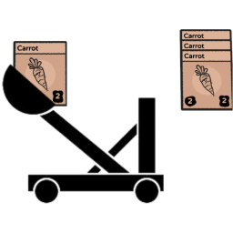

# Stack Further

Allows cards to automatically stack at a further distance.

For example, if an apple tree produces an apple, it will search for a stack to add itself to.

By default this mod doubles the distance the stack search occurs.  This distance is configurable.

# Settings

|Setting|Default|Description|
|--|--|--|
|StackDistance|4|The distance to search for a compatible card to stack onto.  The vanilla default range is 2.|

# Distance Note
The distance is the number of grid locations that can be between the card source and the target stack.  To see the grid, press E when playing the game.  A very faint grid will be shown as the cards are rearranged to the grid.

# Change Log

## 1.1.0
* Added a more complete match for the target IL.  Doesn't change the functionality, just protects against future game code changes that might introduce another 2f constant.
